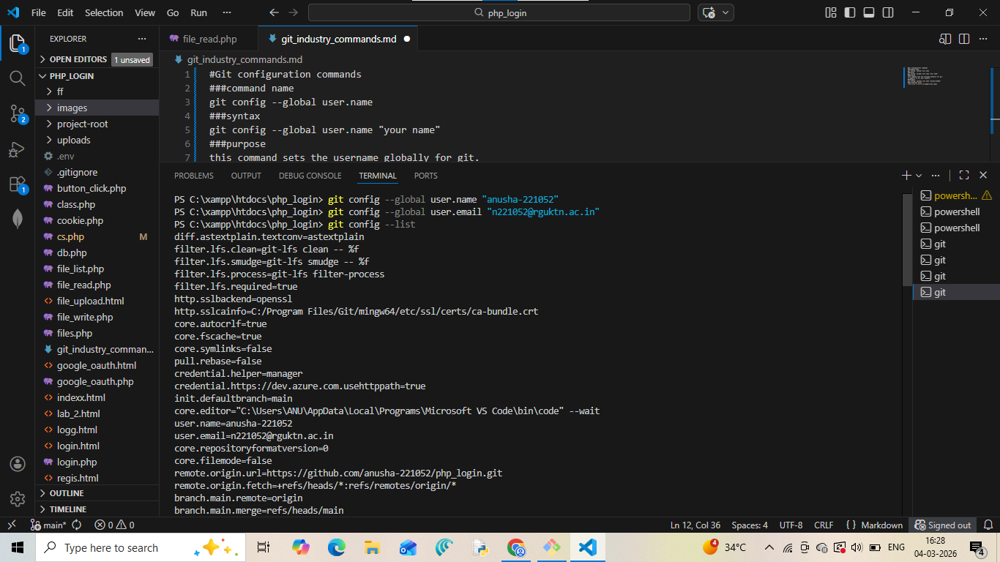
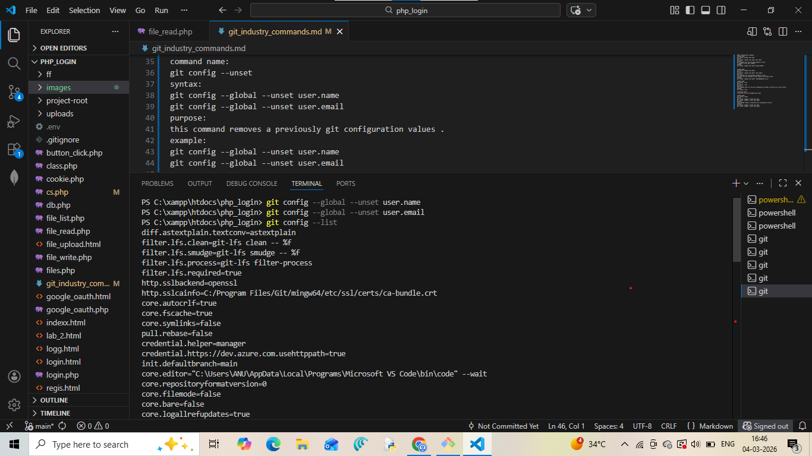

##Git configuration commands

command name:
git config --global user.name

syntax:
git config --global user.name "your name"

purpose:
this command sets the username globally for git.
it appears in all your commits.

example:
git config --global user.name "anusha-221052"

command name:
git config --global user.email

syntax:
git config --global user.email "your email"

purpose:
this command sets the useremail globally for git.
the email will be attached to your commits and linked to git.

example:
git config --global user.email "n221052@rguktn.ac.in"

command name:
git config --list

syntax:
git config --list

purpose:
this command shows all the git configuration settings currently set on your system.

example:
git config --list

screenshot proof:

command name:
git config --unset

syntax:
git config --global --unset user.name
git config --global --unset user.email

purpose:
this command removes a previously git configuration values .

example:
git config --global --unset user.name
git config --global --unset user.email

screenshot proof:

